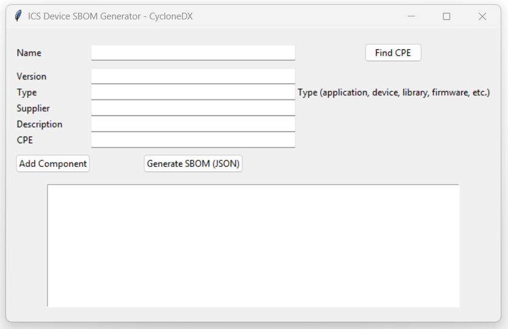
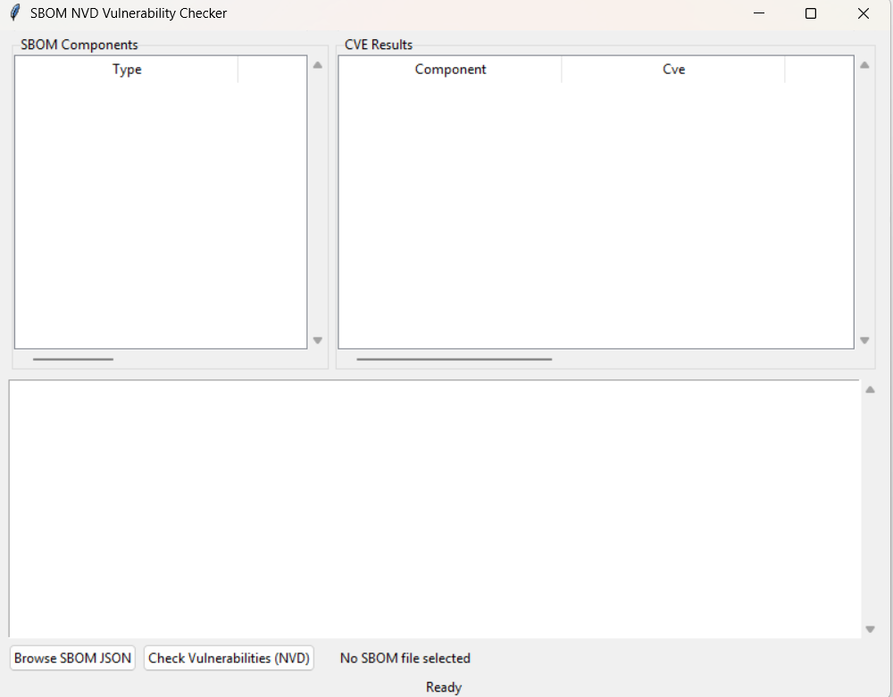

# VirtualPatching

## Overview

**VirtualPatching** is an ongoing research project focused on **SBOM-driven virtual patching** to mitigate cybersecurity risks in **Industrial Control Systems (ICS)** and **Operational Technology (OT)** environments.

It contains three Python-based GUI tools (built with Tkinter) that help:

- ✅ Generate a **Software Bill of Materials (SBOM)**
- ✅ Identify known vulnerabilities
- ✅ Provide detailed information on CVEs (**Common Vulnerabilities and Exposures**)

The project leverages SBOM data to inform **virtual patching strategies** — applying defensive measures to protect vulnerable systems **without altering them** — reducing risk in critical ICS/OT systems.

Using SBOMs in the standard [CycloneDX format](https://cyclonedx.org), the tools enumerate the software components present in a system and cross-reference them with known vulnerabilities from the [National Vulnerability Database (NVD)](https://en.wikipedia.org/wiki/National_Vulnerability_Database).

This process highlights which components have public security issues, enabling teams to plan **mitigations (virtual patches)** for those vulnerabilities.

---

### What is Virtual Patching?

Virtual patching is a **vulnerability-shielding technique** that uses security policies or rules (e.g., firewall or IPS rules) to **prevent exploits** from reaching a vulnerability **without installing** the actual software patch ([source](https://www.txone.com/blog/what-is-virtual-patching/)).

This approach is especially valuable in **ICS/OT environments** where:

- Continuous operation is critical
- Downtime for patching is not acceptable
- Legacy systems or vendor constraints prevent updates ([source](https://www.txone.com/blog/ics-security-virtual-patching/))

By using **SBOM-driven insights** to guide these compensating controls, VirtualPatching helps reduce the **window of exposure** until permanent patches can be applied.

## Disclaimer

This project is intended for **research and educational purposes only**. It is a proof-of-concept prototype, not an officially supported product. Use these tools responsibly and only in safe, controlled environments.

---

## Tools Overview

The repository contains three main Python scripts (located in the repository root):

- `sbom_generator.py`: Generates a Software Bill of Materials (SBOM) in CycloneDX JSON format for a given set of software components. Optionally, this tool can also look up **Common Platform Enumeration (CPE)** identifiers via [NVD](https://csrc.nist.gov/projects/national-vulnerability-database) to enrich the SBOM, helping map components to known vulnerabilities.

- `nvd_checker.py`: Loads an SBOM (in CycloneDX JSON format) and queries the NVD for any known vulnerabilities (CVEs) affecting the components listed. The results include details like CVE IDs, severity scores, and relevant links, helping users identify which components are vulnerable.

- `CVE_Details.py`: Provides a graphical interface to browse and inspect CVE details from a provided CSV file. Users can select a CVE from a dropdown menu to view its description, severity, and recommended mitigation links (such as patches or vendor advisories). This allows quick reference for remediation steps.

---

##Installation

To set up this project locally, follow these steps:

## 🚀 Prerequisites & Setup Guide

Before you begin, make sure you have:

- ✅ Python **3.9 or later** installed (Python **3.11 recommended** for best compatibility)
- ✅ Access to a terminal or command prompt
- ✅ `pip` package manager available

---

### 🔁 Step 1: Clone the Repository

```bash
git clone https://github.com/YourUsername/VirtualPatching.git
cd VirtualPatching
```

---

### 🌱 Step 2: Create a Virtual Environment

```bash
python3 -m venv venv
```

💡 On **Windows**, use:

```bash
python -m venv venv
```

---

### ⚡ Step 3: Activate the Virtual Environment

**On Windows:**

```bash
venv\Scripts\activate
```

**On macOS/Linux:**

```bash
source venv/bin/activate
```

---


## 🛠️ Tools & Dependencies

### 1. Python 3.9+

- Preferably Python **3.11** for full compatibility  
- Download from: [https://www.python.org/downloads/](https://www.python.org/downloads/)

---

### 2. pip (Python package manager)

- Comes bundled with Python 3.4+
- To verify pip is installed, run:

```bash
pip --version
```

## 📦 Python Dependencies (install via `requirements.txt`)

You can install everything in one step:

```bash
pip install -r requirements.txt

```
Or install each package manually:

```bash
pip install requests
pip install cyclonedx-bom
pip install nvdlib
pip install pandas
```

### 🔍 Explanation of Each Package

| Package         | Purpose                                                                |
|----------------|------------------------------------------------------------------------|
| `requests`      | For making HTTP requests to NVD and mitigation URLs                    |
| `cyclonedx-bom` | To support CycloneDX SBOM generation format                           |
| `nvdlib`        | (Optional/experimental) – may help with NVD parsing in future versions |
| `pandas`        | For CSV parsing and handling CVE data in `CVE_Details.py`              |
---


### 🖼️ GUI Support – Tkinter

`tkinter` is part of the standard library in most Python installations.

If it's missing (common in minimal Linux setups), install it using:

#### On Ubuntu/Debian:

```bash
sudo apt install python3-tk
```
#### On Fedora

```bash
sudo dnf install python3-tkinter
```


### 🖥️ Step 5: Run the Tools
Once all dependencies are installed, launch any tool using:
```bash
python sbom_generator.py       # Generate SBOM in CycloneDX format
python nvd_checker.py          # Check SBOM components for known CVEs
python CVE_Details.py          # View CVEs and mitigation info from CSV
```
Each script opens its own GUI window for interaction.
---

## 📁 Project Structure

```plaintext
VirtualPatching/
├── CVE_Details.py
├── nvd_checker.py
├── sbom_generator.py
├── requirements.txt
├── README.md
├── LICENSE
└── .gitignore
```

---
# Screenshots

### 📦 sbom_generator.py – SBOM Generator

**Screenshot 1: Component Entry Form**
> Shows the GUI where users enter component metadata (e.g., name, version, type, supplier) and generate SBOMs.



---

### 🛡️ nvd_checker.py – NVD Vulnerability Checker

**Screenshot 1: SBOM File Loaded**
> The GUI with loaded SBOM components on the left and CVE query panel on the right.




---

### 🧾 CVE_Details.py – CVE Dropdown Viewer

**Screenshot 1: CVE Dropdown Selection**
> To uploaded CSV file and view in details


---


## 🔮 Future Plans

**IPS/IDS Integration:** Future updates will include sample rules and configurations to deploy virtual patching via IDS/IPS for ICS/OT networks.

---

## 📄 License

This project is licensed under the MIT License. See the [LICENSE](LICENSE) file for details.

---

## 📜 requirements.txt

```txt
requests
cyclonedx-bom
nvdlib
pandas
```

---

## 🚫 .gitignore

```gitignore
__pycache__/
*.py[cod]
*$py.class
venv/
ENV/
env/
.venv/
.env
dist/
build/
*.egg-info/
*.log
.DS_Store
Thumbs.db
.vscode/
.idea/
```

---

## 📝 MIT License

```text
MIT License

Copyright (c) 2025 <Your Name>

Permission is hereby granted, free of charge, to any person obtaining a copy
of this software and associated documentation files (the "Software"), to deal 
in the Software without restriction, including without limitation the rights 
to use, copy, modify, merge, publish, distribute, sublicense, and/or sell 
copies of the Software, and to permit persons to whom the Software is 
furnished to do so, subject to the following conditions:

The above copyright notice and this permission notice shall be included in 
all copies or substantial portions of the Software.

THE SOFTWARE IS PROVIDED "AS IS", WITHOUT WARRANTY OF ANY KIND, EXPRESS OR 
IMPLIED, INCLUDING BUT NOT LIMITED TO THE WARRANTIES OF MERCHANTABILITY, 
FITNESS FOR A PARTICULAR PURPOSE AND NONINFRINGEMENT. IN NO EVENT SHALL THE 
AUTHORS OR COPYRIGHT HOLDERS BE LIABLE FOR ANY CLAIM, DAMAGES OR OTHER 
LIABILITY, WHETHER IN AN ACTION OF CONTRACT, TORT OR OTHERWISE, ARISING FROM, 
OUT OF OR IN CONNECTION WITH THE SOFTWARE OR THE USE OR OTHER DEALINGS IN THE 
SOFTWARE.
```
